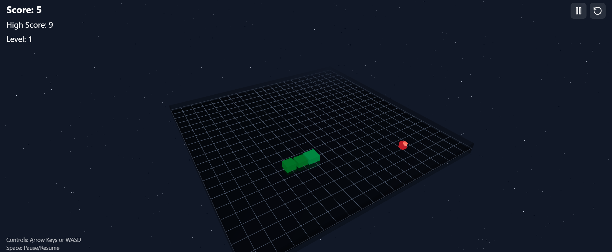

# Proje Adı: 3D Yılan Oyunu

Bu proje, React ve Three.js kullanarak oluşturulmuş bir 3D yılan oyunudur. Oyuncular, klavye ok tuşları veya WASD tuşları ile yılanı kontrol edebilir ve yemeği toplayarak puan kazanabilirler. Oyun, güçlendirmeler ve seviyelerle zenginleştirilmiştir.



## Özellikler

- **3D Grafikler**: Three.js ve @react-three/fiber kullanılarak oluşturulmuş etkileyici 3D grafikler.
- **Dinamik Oyun Mekaniği**: Yılanın hareketi, yemeği toplama ve güçlendirmelerle etkileşim.
- **Güçlendirmeler**: Rastgele ortaya çıkan güçlendirmelerle hız veya ekstra puan kazanma.
- **Seviye Sistemi**: Toplanan puanlara göre artan zorluk seviyesi.
- **Duraklatma ve Yeniden Başlatma**: Oyun sırasında duraklatma ve oyun bitiminde yeniden başlatma seçenekleri.

## Kurulum

1. **Repoyu Klonlayın**:
   ```bash
   git clone https://github.com/kullaniciadi/3d-yilan-oyunu.git
   cd 3d-yilan-oyunu
   ```

2. **Bağımlılıkları Yükleyin**:
   ```bash
   npm install
   ```

3. **Geliştirme Sunucusunu Başlatın**:
   ```bash
   npm run dev
   ```

4. **Tarayıcıda Açın**:
   - Tarayıcınızda `http://localhost:3000` adresine gidin.

## Kullanım

- **Yönlendirme**: Yılanı yönlendirmek için ok tuşlarını veya WASD tuşlarını kullanın.
- **Duraklatma**: Oyunu duraklatmak veya devam ettirmek için boşluk tuşuna basın.
- **Yeniden Başlatma**: Oyun bittiğinde "Play Again" butonuna tıklayın.

## Yapı

- **src/components**: Tüm React bileşenleri burada yer alır.
- **src/store**: Zustand kullanılarak oluşturulmuş oyun durumu yönetimi.
- **src/utils**: Yardımcı fonksiyonlar ve oyun mantığı.
- **public**: Statik dosyalar ve HTML şablonu.

## Katkıda Bulunma

Katkıda bulunmak isterseniz, lütfen bir pull request gönderin veya bir issue açın. Her türlü geri bildirim ve katkı memnuniyetle karşılanır.

## Lisans

Bu proje MIT lisansı altında lisanslanmıştır. Daha fazla bilgi için `LICENSE` dosyasına bakın.